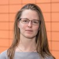

About
=====

Postdoctoral researcher at the Laboratoire of Météorologie Dynamique, Ecole Polytechnique, CNRS
(camille.le-coz@lmd.ipsl.fr)

Publications
============

1. Camille Le Coz, Arnold Heemink, Martin Verlaan, and Nick van de Giesen. [Spatial and time warping for gauge adjustment of rainfall estimates](https://www.mdpi.com/2073-4433/12/11/1510). Atmosphere, 12(11), 2021.
2. Camille Le Coz and Nick van de Giesen. [Comparison of rainfall products over sub-saharan africa. Journal of Hydrometeorology](https://journals.ametsoc.org/view/journals/hydr/21/4/jhm-d-18-0256.1.xml), 21(4):553–596, 2020.
3. Camille Le Coz, Arnold Heemink, Martin Verlaan, Marie-claire ten Veldhuis, and Nick van de Giesen. [Correcting position error in precipitation data using image morphing](https://www.mdpi.com/2072-4292/11/21/2557). Remote Sensing, 11(21), 2019.
4. Maialen Irazoqui Apecechea, Martin Verlaan, Firmijn Zijl, Camille Le Coz, and Herman Kernkamp. [Effects of self-attraction and loading at a regional scale: a test case for the northwest european shelf](https://link.springer.com/article/10.1007/s10236-017-1053-4). Ocean Dynamics, 67(729), 2017. ([Erratum](https://link.springer.com/article/10.1007/s10236-017-1102-z))

Work experience
===============

* Postdoc at the Laboratoire de Météorologie Dynamique (Ecole Polytechnique).
  * From January 2022 to present
* Lecturer at TU Delft
  * From May 2021 to August 2021 at the Faculty of Electrical Engineering, Mathematics and Computer Science (19h per week).
* PhD candidate at TU Delft
  * From January 2016 to June 2021 at the Water Resources Management department.
  

Education
=========

* PhD, TU Delft, 2021
  * PhD thesis: [Setting Africa’s rainfall straight: A warping approach to position and timing errors in rainfall estimates](https://doi.org/10.4233/uuid:811faec9-9688-4f60-829e-3b073fc6fe59).
  * Promotors: Nick van de Giesen and Arnold Heemink
* MSc in Applied Mathematics, TU Delft, 2015.
  * Master thesis: [A modified Proper Orthogonal Decomposition procedure with patterns in time for parameter estimation](http://resolver.tudelft.nl/uuid:0d54e5e6-133b-4c7b-a2b7-6be6e9640ed0).
  * Advisors: Martin Verlaan, Ivan Garcia Triana and Arnold Heemink.
* Diplôme d’ingénieur, Ecole Centrale Marseille, 2016.
  * Equivalent to Master of Engineering
* BSc in Engineering, 2012.
  * obtained by equivalence after Classe préparatoire aux grandes écoles at Lycée Chateaubriand and the first year at Ecole Centrale Marseille.

  
